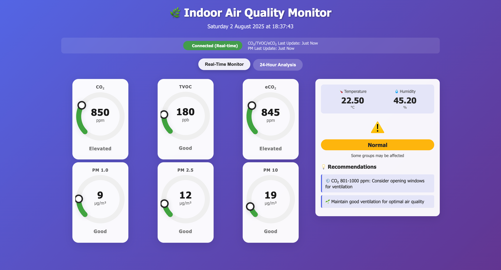

# Indoor Air Quality Monitoring System 🌿

## Introduction 1️⃣
A scalable, Thread-based indoor air quality monitoring prototype designed using nRF52840 DK boards and a Python-based web dashboard. The system collects real-time environmental data (CO₂, TVOC, PM1.0/2.5/10, Temp, Humidity), transmits it via CoAP protocol, and displays actionable insights on a Flask-powered web interface.

⚠️ This project is designed as a proof-of-concept for environments like homes, hospitals, offices, and safety-critical facilities.

## System Overview 📖

### Hardware Setup

*Three nRF52840 DK boards connected and powered up*

### Web Dashboard - Real-Time Monitor

*Live sensor data display with gauges and status indicators*

### Web Dashboard - Historical Analysis

*24-hour trend charts and insights*

### Web Dashboard - Insights

*24-hour insights*

### Network Topology

*Thread network architecture showing client-server communication*


## Tech Stack 🔧
- **Embedded Firmware:** nRF Connect SDK (Zephyr RTOS)
- **MCU Platform:** Nordic nRF52840 DK
- **Wireless Protocol:** Thread (IEEE 802.15.4), CoAP
- **Web App:** Python (Flask, Pandas)
- **Web-Dashboard**: HTML, CSS, JS
- **Serial Interface**: FT232 UART-to-USB

## Overview 📖
This project consists of two client nodes and one server node, all based on nRF52840 DK boards, and a data visualization web application. The client nodes collect sensor data and send it to the server node, which can then be visualized using the provided Python web app.

---

## 1. Setup Client Nodes and Server Node 🛠️

You will need three nRF52840 DK boards:
- **Client Node 1**
- **Client Node 2**
- **Server Node**

**Required Tools:**
- [nRF Connect SDK v2.6.2](https://developer.nordicsemi.com/nRF_Connect_SDK/doc/2.6.2/nrf/index.html) (includes Zephyr, west, and all dependencies)
- [nRF Command Line Tools](https://www.nordicsemi.com/Products/Development-tools/nrf-command-line-tools)

Make sure you have set up the environment for **nRF Connect SDK v2.6.2** before proceeding.

---

## 2. Flash Firmware to Boards 💾

### Flash Client Node 1
```sh
cd client_node1
west build -b nrf52840dk_nrf52840
west flash
```
🔌 Disconnect the board after flashing and label it as **Client Node 1**.

### Flash Client Node 2
```sh
cd ../client_node2
west build -b nrf52840dk_nrf52840
west flash
```
🔌 Disconnect the board after flashing and label it as **Client Node 2**.

### Flash Server Node
```sh
cd ../server_node
west build -b nrf52840dk_nrf52840
west flash
```
🔌 Disconnect the board after flashing and label it as **Server Node**.

---

## 3. Power Up Sequence ⚡
1. **First, turn on (power up) the Server Node.**
2. **Then, turn on (power up) the Client Nodes.**

This ensures proper network initialization and communication.

---

## 4. Data Visualization Web App 📊

### Setup Python Virtual Environment 🐍
```sh
cd ../data_visualization
python3 -m venv venv
source venv/bin/activate
```

### Install Requirements 📦
```sh
pip install -r requirements.txt
```

### Run the Web Application ▶️
```sh
python app.py
```

### Access the Dashboard 🌐
Open your browser and go to:
```
http://127.0.0.1:5000
```

---

## Notes 📝
- Ensure all dependencies for **nRF Connect SDK v2.6.2** and Python are installed.
- If you encounter permission issues with flashing, try running the flash command with `sudo`.
- For more details, refer to the documentation in each node's directory. 

## Documentation 📚

### Final Report
[📄 Download Final Report](documentation/Final-Report.pdf)
*A detailed report on the project and research performed using this setup.*

### Presentation
[📄 Download Presentation](documentation/Presentation.pdf)
*A beamer used to present the project to the clients (i.e: Professors 😉).*